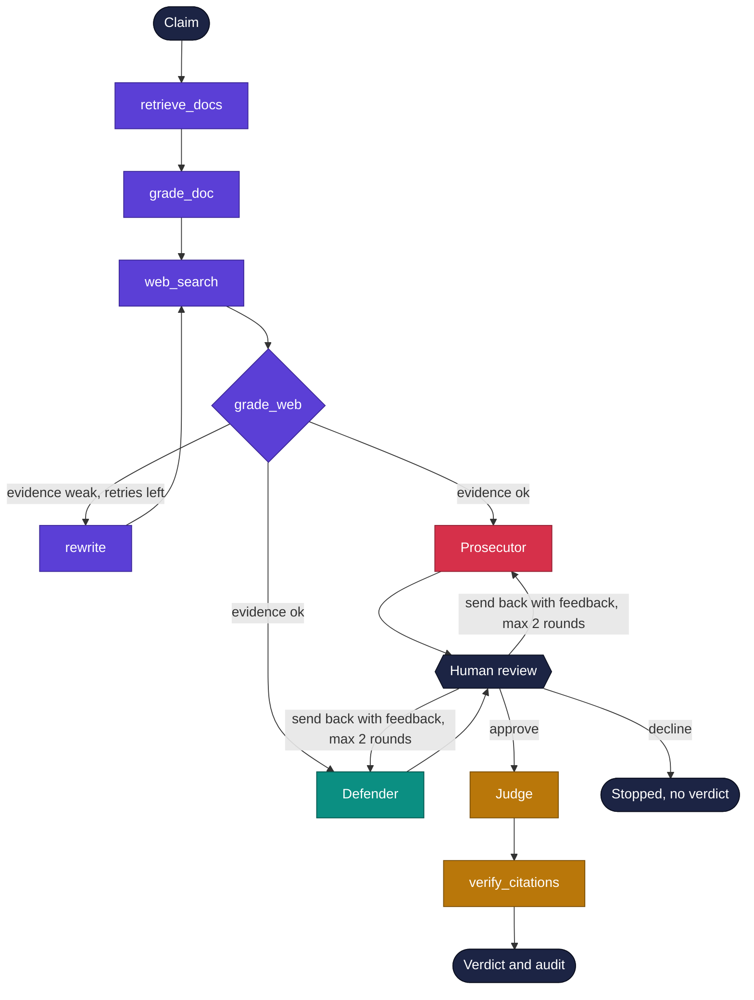
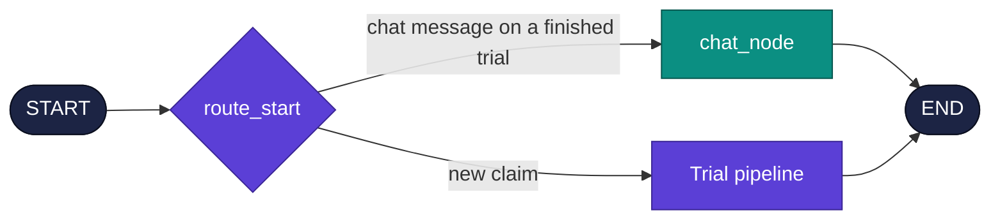
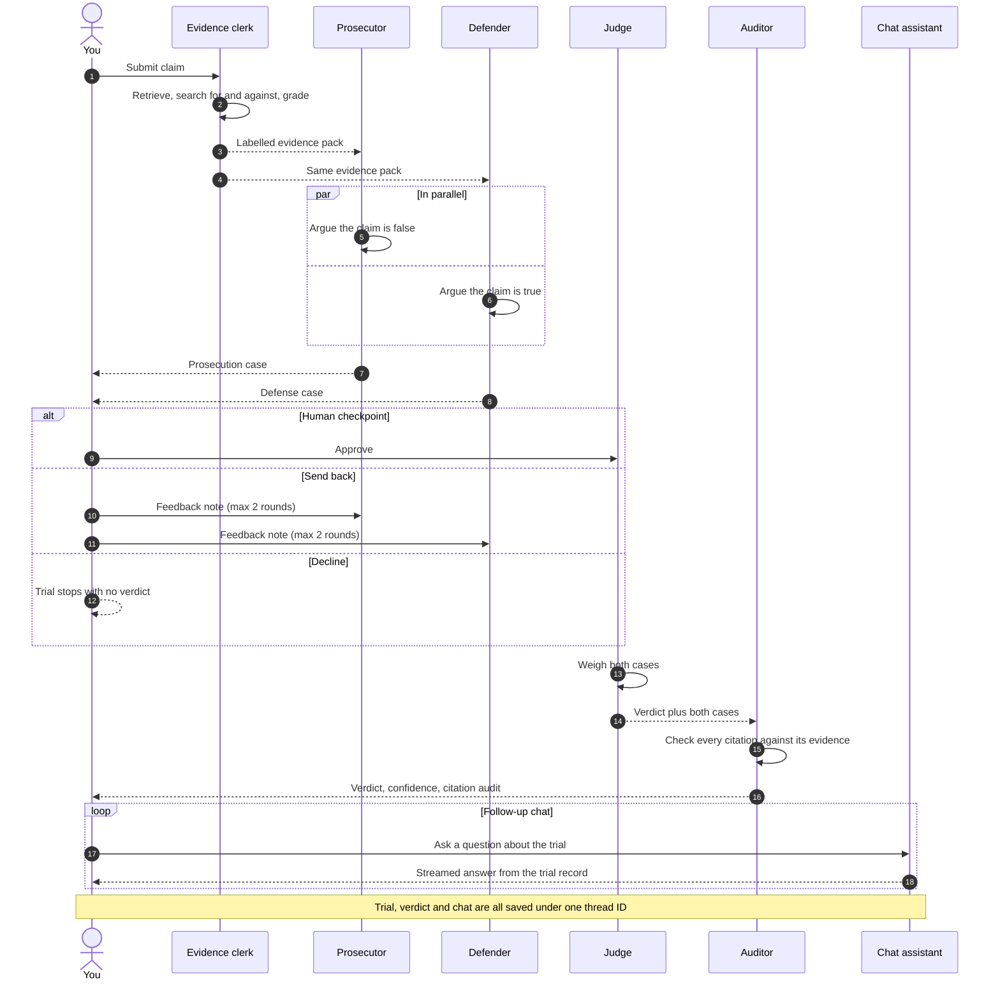
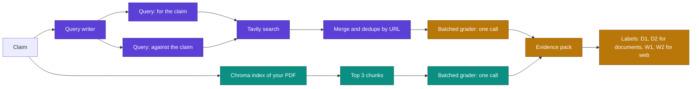
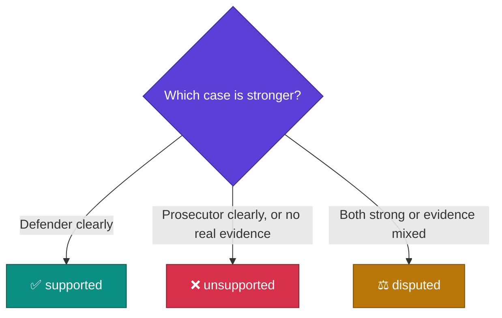
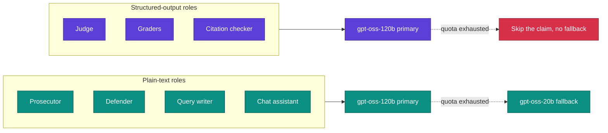
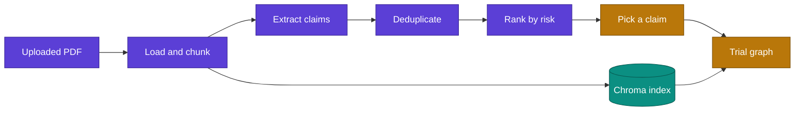
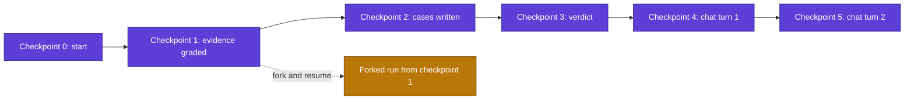

<div align="center">

# ⚖️ Claim Court

### Put the claim on trial.

Two AI lawyers argue opposite sides from the same evidence. A judge rules. An auditor checks that every citation says what the lawyer claimed.


[What it does](#-what-it-does) · [Architecture](#-architecture) · [Design decisions](#-design-decisions) · [Getting started](#-getting-started) · [Evaluation](#-evaluation) · [Roadmap](#-roadmap)

</div>

---

## 🎯 What it does

A single LLM asked "is this true?" tends to give one confident, smooth answer, even when the truth is messy. Claim Court makes two agents fight over the same evidence, then checks whether their citations are honest. You get a verdict and a paper trail you can read.

You give it a claim, either typed in or extracted automatically from a PDF you upload. Then:

| Step | What happens |
| :---: | --- |
| 🔎 | Searches your document for relevant passages |
| 🌐 | Searches the web twice, once for support and once for contradiction |
| 📝 | Grades every piece of evidence as relevant, ambiguous or irrelevant |
| 🔁 | Rewrites the search query and retries if the evidence is weak, up to two times |
| 🗡️ | The **Prosecutor** argues the claim is false while the **Defender** argues it is true, in parallel |
| ✋ | Pauses so a human can read both cases, then approve, send them back with feedback, or decline |
| 👨‍⚖️ | The **Judge** returns `supported`, `disputed` or `unsupported`, with reasoning and confidence |
| 🧾 | A citation audit checks each citation against the evidence it points to |
| 💬 | You can then chat about the trial, with streamed answers grounded in the saved record |
| 🗂️ | Every conversation is saved, so you can start a new one, resume an old one or delete it |

---

## 🏛️ Architecture

### The trial pipeline



After the verdict, follow-up questions take a second route through the same graph: a conditional edge at `START` sends a chat message straight to `chat_node`, which answers from the saved trial record and then ends.



The graph is wired in [graph.py](graph.py). The judge node uses `defer=True`, so it waits until both lawyers finish. The graph is compiled with `interrupt_before=["judge_node"]`, which creates the human review step. State is saved to SQLite after every node, so a paused trial can be resumed later.

### Who talks to whom



### How evidence is gathered



### How the judge picks a label



### The cast

| Role | Job | Output |
| --- | --- | --- |
| 🧑‍💼 **Evidence clerk** | Retrieves and grades document chunks and web results, rewrites weak queries | Labelled evidence pack |
| 🗡️ **Prosecutor** | Argues the claim is false | 3 to 5 bullets, each ending in an evidence label |
| 🛡️ **Defender** | Argues the claim is true | 3 to 5 bullets, each ending in an evidence label |
| 👨‍⚖️ **Judge** | Weighs both cases | Label, 2 to 3 sentences of reasoning, confidence from 0 to 1 |
| 🧾 **Citation auditor** | Checks each citation against its evidence | Verified or failed, with a one-line reason |
| 💬 **Chat assistant** | Answers follow-up questions after the verdict, using only the trial record | Streamed plain-text answers that cite evidence labels |

---

## 🧠 Design decisions

<details open>
<summary><b>🔧 Retrieval is deterministic, not agentic</b></summary>

The pipeline always retrieves, always grades, then hands the lawyers a fixed, labelled evidence pack. It is easier to debug than agent tool-calling and much cheaper on quota.
</details>

<details>
<summary><b>📦 Grading is batched</b></summary>

One LLM call grades all the document chunks and one call grades all the web results. Grading each item separately would burn through the Groq free tier in a handful of trials.
</details>

<details>
<summary><b>↔️ Web search is two-sided</b></summary>

Searching only for support biases the judge. The search runs a "for" query and an "against" query, then merges the results and removes duplicates by URL. This is what lets genuinely contested claims land on `disputed` instead of being pulled toward one side.
</details>

<details>
<summary><b>🔢 Citations are matched by position, not by label</b></summary>

A lawyer can cite `W3` several times. An early version matched audit results back to citations by label and silently overwrote entries. Now every citation gets an `item_number` (its position in the list) and results are matched on that.
</details>

<details>
<summary><b>🚫 Structured-output roles never fall back to a smaller model</b></summary>

The Judge, the graders and the citation checker return Pydantic objects. The smaller `gpt-oss-20b` model was unreliable at that under load, so these roles retry on the primary model only and fail gracefully (skipping the claim) if quota runs out. The Prosecutor, Defender and query writer produce plain text, so they may fall back to the smaller model.
</details>

<details>
<summary><b>✂️ Lawyer output is constrained</b></summary>

Each lawyer writes 3 to 5 bullets, under 200 words, with no bold text, no headers and one sentence per bullet, each ending with its evidence label in brackets. That keeps citations parseable and the two cases easy to compare.
</details>

<details>
<summary><b>✋ The human checkpoint has three exits</b></summary>

At the pause before the judge you can approve, send the cases back, or decline. **Send back** re-runs only the two lawyers, starting from the checkpoint just before they last ran, with your note added to their input. Retrieval and grading are not repeated, which saves quota. It is capped at 2 rounds because each round costs two model calls, and the earlier cases stay in the checkpoint history for time travel. **Decline** records `review_status = "declined"` in the graph state, shows a banner, keeps the trial in the sidebar with a mark, and can be undone with **Reopen**. Both actions use LangGraph's `update_state`, so they survive a page refresh.
</details>

<details>
<summary><b>💬 Chat lives in the graph state</b></summary>

Follow-up messages are stored in `CourtState.messages` (LangGraph's `add_messages` reducer) and saved by the same SQLite checkpointer as the rest of the trial. A conditional edge at `START` (`route_start`) sends a chat message on a finished trial to `chat_node`, and anything else starts a new trial. There is no separate chat database, and one thread ID identifies the trial, its chat, its resume point and its time-travel history.
</details>

<details>
<summary><b>🗂️ Conversations are just threads</b></summary>

A conversation is a LangGraph thread. The sidebar lists threads straight from the checkpointer, resuming loads the latest checkpoint, deleting calls the checkpointer's `delete_thread`, and the thread ID in the page URL survives a browser refresh. Chat opens only after the verdict, because a chat message sent while the graph is paused before the judge would start a new run and lose the pending judge step.
</details>

<details>
<summary><b>⏱️ Rate limits are handled, not ignored</b></summary>

Model calls retry with backoff (2, 5, 10 and 20 seconds) when Groq returns a rate limit error.
</details>

### Model routing



---

## 🧰 Tech stack

| Layer | Choice |
| --- | --- |
| 🕸️ Orchestration | LangGraph (`StateGraph`, conditional edges, `defer=True` fan-in) |
| 🤖 LLM | Groq, `openai/gpt-oss-120b` primary, `openai/gpt-oss-20b` fallback for plain-text roles |
| 📐 Structured output | Pydantic models via `.with_structured_output()` |
| 📚 Document RAG | Chroma with `all-MiniLM-L6-v2` sentence embeddings |
| 🌐 Web search | Tavily Search API |
| 💾 Persistence | SQLite checkpointer (`langgraph-checkpoint-sqlite`) |
| 📄 PDF parsing | `PyPDFLoader` (pypdf) |
| 🖥️ UI | Streamlit |

Everything runs on free tiers. No paid Groq plan is involved or needed.

---

## 🗂️ Project layout

```
claim-court/
├── main.py             CLI entry point, runs one claim through the trial graph
├── app.py              Streamlit UI: PDF upload, claim extraction, trial, chat,
│                       conversations (new, resume, delete), time travel
├── state.py            CourtState (including chat messages) and the Pydantic schemas
├── prompt.py           Every prompt in one place
├── nodes.py            Graph nodes: retrieval, grading, lawyers, judge, audit, chat
├── graph.py            Graph wiring, SQLite checkpointer, human review interrupt,
│                       chat routing, saved-thread listing
├── ingestion/          PDF loading, chunking, claim extraction, dedup, ranking
├── retrieval/
│   ├── vectorstore.py  Chroma setup, retrieval, uploaded document swapping
│   └── websearch.py    Tavily search tool
├── eval/
│   ├── claims.json     12 claims with expected labels
│   ├── run_eval.py     Resumable evaluation harness
│   └── results.json    Saved results
├── data/               Bundled USDA report and its cached claim ranking
├── requirements.txt
├── .env.example        Template for the three keys the app needs
└── .streamlit/config.toml
```

### PDF ingestion path



---

## 🚀 Getting started

### Prerequisites

- 🐍 Python 3.10 or newer
- 🔑 A free [Groq](https://console.groq.com) API key
- 🔑 A free [Tavily](https://tavily.com) API key

### Install

```bash
git clone <your-repo-url>
cd claim-court
python3 -m venv venv
source venv/bin/activate
pip install -r requirements.txt
```

### Configure

Copy `.env.example` to `.env` (or create it) in the project root:

```
GROQ_API_KEY=your_groq_key
TAVILY_API_KEY=your_tavily_key
MODEL_NAME=openai/gpt-oss-120b
```

The first run downloads the embedding model, so allow a minute before anything appears.

---

## 🕹️ Usage

### 🖥️ Web app

```bash
python3 -m streamlit run app.py
```

> Use `python3 -m streamlit`, not bare `streamlit`. The bare command can pick up a Python outside your virtual environment and fail on imports.

In the app you can:

1. Upload a PDF and let it extract and rank the riskiest claims, or type your own claim.
2. Run the trial and watch live progress as each node finishes.
3. Read the Prosecutor's and Defender's cases.
4. Send the case to the Judge for a verdict, send it back to the lawyers with feedback (up to 2 rounds), or decline to send it. A declined trial can be reopened later.
5. Review the citation check, then ask follow-up questions in the chat box. Answers stream in and use only the trial record (claim, labelled evidence, both cases, verdict and citation check).

Conversations are saved automatically. The sidebar has a **New conversation** button and a **Past conversations** list. Click one to resume it with its cases, verdict and full chat, or use the bin icon to delete it. The trial's thread ID is kept in the page URL, so a browser refresh reopens the same conversation.

Chat messages are stored in the LangGraph state and saved by the SQLite checkpointer, the same as the rest of the trial, so no separate database is involved. Chat opens once the judge has ruled.

### ⌨️ Command line

```bash
python3 main.py
```

Takes the top-ranked claim from the bundled USDA document, streams each node as it finishes, and asks for your approval before calling the judge. If you decline, it prints a thread ID so you can resume later.

### ⏪ Time travel

Time travel lives in the sidebar of the web app. Pick any checkpoint from the current trial's history and press **Resume from this checkpoint**, and the graph re-runs from that exact point. Chat turns are checkpoints too, so rewinding also restores the chat as it was. This is useful for seeing how a verdict changes when you rerun from a particular step.



---

## 📊 Evaluation

The eval set in [eval/claims.json](eval/claims.json) has 12 claims across the three labels:

| Expected label | Examples |
| --- | --- |
| ✅ `supported` | "Earth goes around the Sun." "Water boils at 100 degrees Celsius at sea level." |
| ❌ `unsupported` | "Humans use only 10 percent of their brains." "Vaccines cause autism." |
| ⚖️ `disputed` | "Coffee is good for health." "Remote work makes employees more productive." |

Some claims come from the bundled USDA quick-commerce report, so the document retrieval path is tested as well as the web path.

```bash
python3 -m eval.run_eval
```

The harness is resumable. If the Groq daily quota runs out partway through, run it again later and it continues where it stopped.

### Saved results

| Claim | Expected | Judge | Confidence |
| --- | :---: | :---: | :---: |
| Earth goes around the Sun | ✅ | ✅ | 0.86 |
| Great Wall visible from the Moon | ❌ | ❌ | 0.88 |
| Remote work makes employees more productive | ⚖️ | ⚖️ | 0.73 |
| Swiggy $115 million Instamart investment | ✅ | ✅ | 0.86 |
| India online grocery up 45 percent by 2030 | ❌ | ❌ | 0.86 |
| India internet access reached 895,000 users | ❌ | ❌ | 0.86 |
| Coffee is good for health | ⚖️ | ⚖️ | 0.78 |
| Nuclear power is safe | ⚖️ | ⚖️ | 0.71 |
| Humans use only 10 percent of their brains | ❌ | ❌ | 0.86 |
| Vaccines cause autism | ❌ | ❌ | 0.88 |

> **Status:** the last full run scored 12 out of 12, but that predates the most recent changes to batch grading, citation matching and the lawyer prompts, so it needs a fresh run before that number is trusted. The saved `results.json` holds the 10 completed claims above, all matching their expected labels. Twelve mostly easy claims is also a small test, and a larger set with more genuinely disputed claims is on the roadmap.

---

## 🩹 Known quirks

| Symptom | Cause | Action |
| --- | --- | --- |
| `No module named 'torchvision'` in the Streamlit log | Streamlit's file watcher introspects `transformers` submodules | Harmless, silenced by `fileWatcherType = "none"` in `.streamlit/config.toml` |
| `Deserializing unregistered type state.VerdictClass` when loading a past trial | LangGraph checkpointer forward-compatibility notice | Safe to ignore |
| A chat question shows an error and no answer | Groq rate limit or a model failure during the chat turn | The question stays in the history. Ask again |
| The chat box is missing | Chat opens only after the judge rules, and a declined trial has no verdict | Send the case to the Judge first, or press Reopen on a declined trial |
| Rate limit messages or skipped claims | Groq free-tier daily quota | Wait and rerun, the eval harness resumes automatically |

---

## 🗺️ Roadmap

- [ ] Larger eval set, with ablations against a single-LLM baseline and a version without the retry loop
- [ ] Unit tests for deduplication, `item_number` matching and state handling, with LLM calls mocked
- [ ] Hybrid keyword and vector retrieval, plus a reranker
- [ ] Source credibility weighting for web results
- [ ] Chat before the verdict, without losing the pending judge step
- [ ] Export a finished trial, citations included, as a shareable report

---

## 🤝 Contributing

Issues and pull requests are welcome. Two ground rules: keep the project free to run, and keep changes simple. If a smaller solution does the job, prefer it.

<div align="center">

Built with LangGraph, Groq, Chroma and Tavily. Runs entirely on free tiers.

</div>
